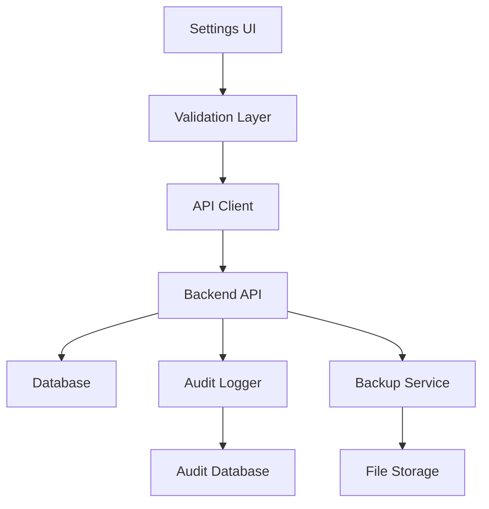

# Enhanced Hospital Settings - Design Document

## Overview

The Enhanced Hospital Settings feature builds upon the existing settings page to provide a comprehensive, robust, and user-friendly configuration management system. The design focuses on improving data validation, adding backup/restore capabilities, integrating with backend APIs, and providing advanced features like audit logging and department-specific settings.

## Architecture

### Frontend Architecture

```
Enhanced Settings Page
├── Settings Navigation (Enhanced)
├── Form Validation Layer
├── API Integration Layer
├── Backup/Restore Manager
├── Audit Log Viewer
├── Department Settings Manager
└── Notification Template Editor
```

### Backend Architecture

```
Settings API Layer
├── Settings Controller
├── Validation Middleware
├── Audit Logger
├── Backup Service
├── Department Manager
└── Notification Service
```

### Data Flow



## Components and Interfaces

### 1. Enhanced Settings Form Component

**Purpose:** Improved form handling with comprehensive validation

**Key Features:**
- Real-time validation with debounced input
- Field-level error display
- Form state management with dirty checking
- Auto-save functionality with conflict resolution

**Interface:**
```typescript
interface EnhancedSettingsForm {
  settings: HospitalSettings
  errors: ValidationErrors
  isDirty: boolean
  isValid: boolean
  onFieldChange: (field: string, value: any) => void
  onValidate: (field?: string) => Promise<ValidationResult>
  onSave: () => Promise<SaveResult>
  onReset: () => void
}
```

### 2. Backup/Restore Manager

**Purpose:** Handle settings backup and restore operations

**Key Features:**
- Export settings to JSON with metadata
- Import validation and preview
- Automatic backup before major changes
- Version management and rollback

**Interface:**
```typescript
interface BackupManager {
  exportSettings: () => Promise<BackupFile>
  importSettings: (file: File) => Promise<ImportPreview>
  applyImport: (preview: ImportPreview) => Promise<void>
  listBackups: () => Promise<BackupMetadata[]>
  restoreFromBackup: (backupId: string) => Promise<void>
}
```

### 3. Department Settings Manager

**Purpose:** Manage department-specific configurations

**Key Features:**
- Department CRUD operations
- Settings inheritance and overrides
- Bulk operations across departments
- Template-based department creation

**Interface:**
```typescript
interface DepartmentManager {
  departments: Department[]
  selectedDepartment: Department | null
  createDepartment: (data: DepartmentData) => Promise<Department>
  updateDepartment: (id: string, data: Partial<DepartmentData>) => Promise<void>
  deleteDepartment: (id: string) => Promise<void>
  copySettings: (fromId: string, toId: string) => Promise<void>
}
```

### 4. Audit Log Viewer

**Purpose:** Display and manage settings change history

**Key Features:**
- Chronological change display
- Filtering and search capabilities
- Export functionality
- Change comparison view

**Interface:**
```typescript
interface AuditLogViewer {
  logs: AuditEntry[]
  filters: AuditFilters
  onFilter: (filters: AuditFilters) => void
  onExport: (format: 'csv' | 'json') => Promise<void>
  onCompare: (entryId1: string, entryId2: string) => void
}
```

### 5. Notification Template Editor

**Purpose:** Customize notification templates with rich editing

**Key Features:**
- Rich text editor for email templates
- Variable placeholder system
- Template preview functionality
- Multi-language support

**Interface:**
```typescript
interface TemplateEditor {
  template: NotificationTemplate
  variables: TemplateVariable[]
  onEdit: (content: string) => void
  onPreview: () => Promise<string>
  onTest: (recipient: string) => Promise<void>
  onSave: () => Promise<void>
}
```

## Data Models

### Enhanced Hospital Settings

```typescript
interface EnhancedHospitalSettings extends HospitalSettings {
  // Metadata
  version: string
  lastModified: Date
  modifiedBy: string
  
  // Department-specific settings
  departments: DepartmentSettings[]
  
  // Advanced notification settings
  notificationTemplates: NotificationTemplate[]
  
  // System preferences
  autoBackup: boolean
  backupFrequency: 'daily' | 'weekly' | 'monthly'
  auditRetentionDays: number
}
```

### Department Settings

```typescript
interface DepartmentSettings {
  id: string
  name: string
  code: string
  isActive: boolean
  
  // Override hospital-level settings
  operatingHours?: OperatingHours
  appointmentSettings?: AppointmentSettings
  notificationSettings?: NotificationSettings
  
  // Department-specific settings
  headOfDepartment: string
  contactInfo: ContactInfo
  specializations: string[]
  equipment: Equipment[]
}
```

### Audit Entry

```typescript
interface AuditEntry {
  id: string
  timestamp: Date
  userId: string
  userName: string
  action: 'create' | 'update' | 'delete' | 'restore'
  category: string
  fieldName: string
  oldValue: any
  newValue: any
  ipAddress: string
  userAgent: string
}
```

### Backup Metadata

```typescript
interface BackupMetadata {
  id: string
  filename: string
  createdAt: Date
  createdBy: string
  size: number
  version: string
  description?: string
  isAutomatic: boolean
}
```

## Error Handling

### Validation Strategy

1. **Client-side Validation:**
   - Real-time field validation using Yup schema
   - Custom validation rules for hospital-specific data
   - Cross-field validation (e.g., operating hours consistency)

2. **Server-side Validation:**
   - Comprehensive data validation before saving
   - Business rule validation
   - Data integrity checks

3. **Error Display:**
   - Field-level error messages
   - Form-level error summary
   - Toast notifications for system errors

### Error Recovery

1. **Auto-save Recovery:**
   - Periodic saving of form state to localStorage
   - Recovery prompt on page reload
   - Conflict resolution for concurrent edits

2. **Backup Recovery:**
   - Automatic backup before major changes
   - One-click rollback functionality
   - Change preview before applying

## Testing Strategy

### Unit Testing

1. **Component Testing:**
   - Form validation logic
   - Data transformation functions
   - API integration functions
   - Backup/restore operations

2. **Service Testing:**
   - Settings API endpoints
   - Validation middleware
   - Audit logging service
   - Backup service operations

### Integration Testing

1. **API Integration:**
   - Settings CRUD operations
   - File upload/download
   - Real-time validation
   - Error handling scenarios

2. **User Workflow Testing:**
   - Complete settings configuration flow
   - Backup and restore workflow
   - Department management workflow
   - Audit log viewing and filtering

### End-to-End Testing

1. **Critical Paths:**
   - Hospital administrator configures all settings
   - Settings backup and restore process
   - Department-specific configuration
   - Audit trail verification

2. **Error Scenarios:**
   - Network failure during save
   - Invalid backup file import
   - Concurrent user modifications
   - System recovery after errors

## Security Considerations

### Data Protection

1. **Sensitive Data Handling:**
   - Encryption of backup files
   - Secure API communication (HTTPS)
   - Input sanitization and validation
   - SQL injection prevention

2. **Access Control:**
   - Role-based access to settings sections
   - Audit trail for all changes
   - Session management and timeout
   - Multi-factor authentication support

### Backup Security

1. **File Security:**
   - Encrypted backup files
   - Secure file storage
   - Access logging for backup operations
   - Retention policy enforcement

2. **Import Validation:**
   - File format validation
   - Content sanitization
   - Malicious content detection
   - Safe import process

## Performance Considerations

### Frontend Optimization

1. **Form Performance:**
   - Debounced validation
   - Lazy loading of settings sections
   - Efficient re-rendering with React.memo
   - Virtual scrolling for large lists

2. **Data Management:**
   - Optimistic updates for better UX
   - Efficient state management
   - Caching of frequently accessed data
   - Progressive loading of settings

### Backend Optimization

1. **API Performance:**
   - Efficient database queries
   - Response caching where appropriate
   - Batch operations for bulk updates
   - Asynchronous processing for heavy operations

2. **File Operations:**
   - Streaming for large backup files
   - Compression for backup storage
   - Background processing for exports
   - Cleanup of temporary files

## Implementation Phases

### Phase 1: Core Enhancements
- Enhanced form validation
- Basic backup/restore functionality
- API integration improvements
- Error handling enhancements

### Phase 2: Advanced Features
- Department-specific settings
- Audit logging system
- Notification template editor
- Advanced backup management

### Phase 3: Enterprise Features
- Multi-hospital configuration
- Advanced reporting
- Integration APIs
- Performance optimizations